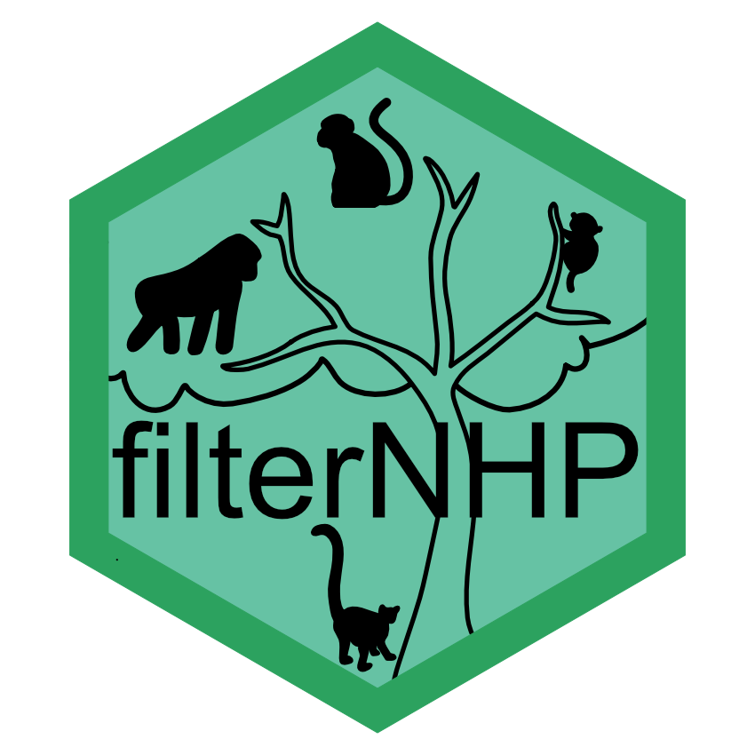

<!-- README.md is generated from README.Rmd. Please edit that file -->

# filterNHP <a></a>

Non-human primate (NHP) search filters.

`filterNHP` is an R package and web-based application for generating
search filters to query scientific bibliographic sources
([PubMed](https://pubmed.ncbi.nlm.nih.gov/), [PsycINFO via
EBSCOhost](https://search.ebscohost.com:443/Login.aspx?profile=web&defaultdb=psyh&lp=login.asp&ref=https%3A%2F%2Fwww%2Egoogle%2Ecom%2F&authtype=ip,uid)
and [Web of
Science](http://login.webofknowledge.com/error/Error?Error=IPError&PathInfo=%2F&RouterURL=http%3A%2F%2Fwww.webofknowledge.com%2F&Domain=.webofknowledge.com&Src=IP&Alias=WOK5))
for non-human primate related publications. Search filters are designed
for researchers wishing to conduct unbiased and comprehensive literature
reviews.

## Installation

You can install `filterNHP` from [GitHub](https://github.com/) with:

``` r
# install.packages("remotes")
remotes::install_github("avrincon/filterNHP")
```

## App

A user-friendly [Shiny App](https://shiny.rstudio.com) implementation
can be found at [filternhp.dpz.eu](https://filternhp.dpz.eu).

If you have the `filterNHP` package installed, you can launch the Shiny
App from the R console with `filterNHP::run_filter_nhp_app()`.

## Example

``` r
library(filterNHP)
```

The core function of this package is `filter_nhp()`. To create a search
filter the user must specify a bibliographic source and taxa of
interest. By default the function prints a search filter for all
non-human primates, formatted for PubMed.

``` r
filter_nhp(source = "PubMed", 
           taxa = "nonhuman_primates")
#> "catarrhini"[mh:noexp] OR "cercopithecidae"[mh] OR "gorilla gorilla"[mh] OR "haplorhini"[mh:noexp] OR "hominidae"[mh:noexp] OR "hylobatidae"[mh] OR "pan paniscus"[mh] OR "pan troglodytes"[mh] OR "platyrrhini"[mh] OR "pongo"[mh] OR "primates"[mh:noexp] OR "strepsirhini"[mh] OR "tarsii"[mh] OR "allenopithecus"[tiab] OR "allocebus"[tiab] OR "alouatta"[tiab] OR "alouattinae"[tiab] OR "angwantibo*"[tiab] OR "anthropoid"[tiab] OR "anthropoidea"[tiab] OR "anthropoids"[tiab] OR "aotes"[tiab] OR "aotidae"[tiab] OR "aotinae"[tiab] OR "aotus"[tiab] OR "ape"[tiab] OR "apes"[tiab] OR "arctocebus"[tiab] OR "ateles"[tiab] OR "atelidae"[tiab] OR "atelinae"[tiab] OR "avahi"[tiab] OR "aye-aye*"[tiab] OR "baboon"[tiab] OR "baboons"[tiab] OR "bonobo"[tiab] OR "bonobos"[tiab] OR "brachyteles"[tiab] OR "bushbabies"[tiab] OR "bushbaby"[tiab] OR "cacajao"[tiab] OR "callibella"[tiab] OR "callicebinae"[tiab] OR "callicebus"[tiab] OR "callimico"[tiab] OR "callithrichid*"[tiab] OR "callithrichinae"[tiab] OR "callithrix"[tiab] OR "callitrichid"[tiab] OR "callitrichidae"[tiab] OR "callitrichide"[tiab] OR "callitrichids"[tiab] OR "callitrichinae"[tiab] OR "capuchin"[tiab] OR "capuchins"[tiab] OR "carlito syrichta"[tiab] OR "catarhine*"[tiab] OR "catarhini"[tiab] OR "catarrhina"[tiab] OR "catarrhine*"[tiab] OR "catarrhini"[tiab] OR "cebid"[tiab] OR "cebidae"[tiab] OR "cebids"[tiab] OR "cebinae"[tiab] OR "ceboidea"[tiab] OR "cebuella"[tiab] OR "cebus"[tiab] OR "cephalopachus"[tiab] OR "cercocebus"[tiab] OR "cercopithecid*"[tiab] OR "cercopithecinae"[tiab] OR "cercopithecine*"[tiab] OR "cercopithecini"[tiab] OR "cercopithecoid"[tiab] OR "cercopithecoidea"[tiab] OR "cercopithecoids"[tiab] OR "cercopithecus"[tiab] OR "cheirogaleidae"[tiab] OR "cheirogaleus"[tiab] OR "cheracebus"[tiab] OR "chimp"[tiab] OR "chimpanzee"[tiab] OR "chimpanzees"[tiab] OR "chimps"[tiab] OR "chiromyiformes"[tiab] OR "chiropotes"[tiab] OR "chlorocebus"[tiab] OR "colobidae"[tiab] OR "colobinae"[tiab] OR "colobine*"[tiab] OR "colobini"[tiab] OR "colobus*"[tiab] OR "cynomolgus"[tiab] OR "daubentonia"[tiab] OR "daubentoniidae"[tiab] OR "douc"[tiab] OR "doucs"[tiab] OR "erythrocebus"[tiab] OR "eulemur"[tiab] OR "euoticus"[tiab] OR "euprimate*"[tiab] OR "galagid*"[tiab] OR "galago"[tiab] OR "galagoides"[tiab] OR "galagonidae"[tiab] OR "galagos"[tiab] OR "gelada"[tiab] OR "geladas"[tiab] OR "gibbon"[tiab] OR "gibbons"[tiab] OR "gorilla"[tiab] OR "gorillas"[tiab] OR "grivet"[tiab] OR "grivets"[tiab] OR "guenon*"[tiab] OR "guereza*"[tiab] OR "hapalemur"[tiab] OR "haplorhine*"[tiab] OR "haplorhini"[tiab] OR "haplorrhine*"[tiab] OR "haplorrhini"[tiab] OR "hominid*"[tiab] OR "hominin"[tiab] OR "homininae"[tiab] OR "hominine"[tiab] OR "hominines"[tiab] OR "hominini"[tiab] OR "hominins"[tiab] OR "hominoidea"[tiab] OR "hoolock"[tiab] OR "howler*"[tiab] OR "hylobates"[tiab] OR "hylobatidae"[tiab] OR "indri"[tiab] OR "indridae"[tiab] OR "indriid*"[tiab] OR "indris"[tiab] OR "kipunji*"[tiab] OR "lagothrix"[tiab] OR "langur"[tiab] OR "langurs"[tiab] OR "lemur"[tiab] OR "lemurid*"[tiab] OR "lemuriform"[tiab] OR "lemuriformes"[tiab] OR "lemuriforms"[tiab] OR "lemurinae"[tiab] OR "lemuroidea"[tiab] OR "lemurs"[tiab] OR "leontideus"[tiab] OR "leontocebus"[tiab] OR "leontopithecus"[tiab] OR "lepilemur"[tiab] OR "lepilemurid*"[tiab] OR "lesula*"[tiab] OR "lophocebus"[tiab] OR "loriform"[tiab] OR "loriformes"[tiab] OR "lorinae"[tiab] OR "loris"[tiab] OR "lorises"[tiab] OR "lorisid*"[tiab] OR "lorisiform*"[tiab] OR "lorisinae"[tiab] OR "lorisoid*"[tiab] OR "lutung"[tiab] OR "lutungs"[tiab] OR "macaca"[tiab] OR "macaque's"[tiab] OR "macaque"[tiab] OR "macaques"[tiab] OR "malbrouck*"[tiab] OR "mandrill"[tiab] OR "mandrills"[tiab] OR "mandrillus"[tiab] OR "mangabey*"[tiab] OR "marmoset"[tiab] OR "marmosets"[tiab] OR "mico argentatus"[tiab] OR "mico chrysoleucos"[tiab] OR "mico emiliae"[tiab] OR "mico humilis"[tiab] OR "mico marcai"[tiab] OR "mico melanurus"[tiab] OR "mico rondoni"[tiab] OR "microcebus"[tiab] OR "miopithecus"[tiab] OR "mirza coquereli"[tiab] OR "mirza zaza"[tiab] OR "monkey"[tiab] OR "monkeys"[tiab] OR "muriqui*"[tiab] OR "nasalis larvatus"[tiab] OR "nomascus"[tiab] OR "nycticebus"[tiab] OR "oedipomidas"[tiab] OR "orang utan*"[tiab] OR "orang-utan*"[tiab] OR "orangutan*"[tiab] OR "oreonax"[tiab] OR "otolemur"[tiab] OR "pan paniscus"[tiab] OR "pan troglodytes"[tiab] OR "panin"[tiab] OR "panina"[tiab] OR "panins"[tiab] OR "papio"[tiab] OR "papionini"[tiab] OR "paragalago"[tiab] OR "perodicticinae"[tiab] OR "perodicticus"[tiab] OR "phaner"[tiab] OR "piliocolobus"[tiab] OR "pithecia"[tiab] OR "pithecidae"[tiab] OR "pitheciid*"[tiab] OR "pitheciinae"[tiab] OR "pithecinae"[tiab] OR "platyrhine*"[tiab] OR "platyrhini"[tiab] OR "platyrrhina"[tiab] OR "platyrrhine*"[tiab] OR "platyrrhini"[tiab] OR "plecturocebus"[tiab] OR "pongid*"[tiab] OR "ponginae"[tiab] OR "pongo"[tiab] OR "potto"[tiab] OR "pottos"[tiab] OR "presbytini"[tiab] OR "presbytis"[tiab] OR "primate"[tiab] OR "primates"[tiab] OR "procolobus"[tiab] OR "prolemur"[tiab] OR "propithecus"[tiab] OR "prosimian*"[tiab] OR "prosimii"[tiab] OR "pseudopotto"[tiab] OR "pygathrix"[tiab] OR "rhinopithecus"[tiab] OR "rungwecebus"[tiab] OR "saguinus"[tiab] OR "saimiri"[tiab] OR "saimiriinae"[tiab] OR "sapajus"[tiab] OR "sciurocheirus"[tiab] OR "semnopithecus"[tiab] OR "siamang"[tiab] OR "siamangs"[tiab] OR "sifaka"[tiab] OR "sifakas"[tiab] OR "simians"[tiab] OR "simias"[tiab] OR "simiiform*"[tiab] OR "strepsir*"[tiab] OR "surili*"[tiab] OR "symphalangus"[tiab] OR "talapoin*"[tiab] OR "tamarin"[tiab] OR "tamarins"[tiab] OR "tamarinus"[tiab] OR "tarsier"[tiab] OR "tarsiers"[tiab] OR "tarsiid*"[tiab] OR "tarsiiform*"[tiab] OR "tarsius"[tiab] OR "theropithecus"[tiab] OR "trachypithecus"[tiab] OR "uacari*"[tiab] OR "uakari"[tiab] OR "uakaris"[tiab] OR "varecia"[tiab] OR "vervet*"[tiab]
```

It is also possible to create search filters for any NHP taxon or
combination of taxa, down to the genus level. For example:

``` r
filter_nhp(source = "PsycInfo", 
           taxa = "Catarrhini")
#> DE("baboons" OR "bonobos" OR "chimpanzees" OR "gorillas") OR TX("african monkey*" OR "allen's swamp monkey*" OR "allenopithecus" OR "ape" OR "apes" OR "asian monkey*" OR "baboon" OR "baboons" OR "bonobo" OR "bonobos" OR "catarhine*" OR "catarhini" OR "catarrhina" OR "catarrhine*" OR "catarrhini" OR "cercocebus" OR "cercopithecid*" OR "cercopithecinae" OR "cercopithecine*" OR "cercopithecini" OR "cercopithecoid" OR "cercopithecoidea" OR "cercopithecoids" OR "cercopithecus" OR "chimp" OR "chimpanzee" OR "chimpanzees" OR "chimps" OR "chlorocebus" OR "colobidae" OR "colobinae" OR "colobine*" OR "colobini" OR "colobus*" OR "cynomolgus" OR "douc" OR "doucs" OR "erythrocebus" OR "gelada" OR "geladas" OR "gibbon" OR "gibbons" OR "gorilla" OR "gorillas" OR "grivet" OR "grivets" OR "guenon*" OR "guereza*" OR "hominid*" OR "hominin" OR "homininae" OR "hominine" OR "hominines" OR "hominini" OR "hominins" OR "hominoidea" OR "hoolock" OR "hylobates" OR "hylobatidae" OR "kipunji*" OR "langur" OR "langurs" OR "leaf eating monkey*" OR "leaf monkey*" OR "leaf-eating monkey*" OR "lesula*" OR "lophocebus" OR "lutung" OR "lutungs" OR "macaca" OR "macaque's" OR "macaque" OR "macaques" OR "malbrouck*" OR "mandrill" OR "mandrills" OR "mandrillus" OR "mangabey*" OR "miopithecus" OR "mona monkey*" OR "nasalis larvatus" OR "nomascus" OR "old world monkey*" OR "old world non-human primate*" OR "old world nonhuman primate*" OR "old world primate*" OR "orang utan*" OR "orang-utan*" OR "orangutan*" OR "pan paniscus" OR "pan troglodytes" OR "panin" OR "panina" OR "panins" OR "papio" OR "papionini" OR "patas monkey*" OR "piliocolobus" OR "pongid*" OR "ponginae" OR "pongo" OR "presbytini" OR "presbytis" OR "proboscis monkey*" OR "procolobus" OR "pygathrix" OR "rhesus monkey*" OR "rhinopithecus" OR "rungwecebus" OR "semnopithecus" OR "siamang" OR "siamangs" OR "simias" OR "snub-nosed monkey*" OR "surili*" OR "symphalangus" OR "talapoin*" OR "theropithecus" OR "trachypithecus" OR "vervet*")
```

``` r
filter_nhp(source = "WebOfScience", 
           taxa = c("Papio", "Theropithecus", "Mandrillus"))
#> TS=("baboon" OR "baboons" OR "gelada" OR "geladas" OR "mandrill" OR "mandrills" OR "mandrillus" OR "papio leucophaeus" OR "papio sphinx" OR "papio" OR "theropithecus")
```

``` r
filter_nhp(source = "PubMed", 
           taxa = c("Hylobatidae", "Ponginae"))
#> "hylobatidae"[mh] OR "pongo"[mh] OR "gibbon"[tiab] OR "gibbons"[tiab] OR "hoolock"[tiab] OR "hylobates"[tiab] OR "hylobatidae"[tiab] OR "lesser ape*"[tiab] OR "nomascus"[tiab] OR "orang utan*"[tiab] OR "orang-utan*"[tiab] OR "orangutan*"[tiab] OR "pongid*"[tiab] OR "ponginae"[tiab] OR "pongo"[tiab] OR "siamang"[tiab] OR "siamangs"[tiab] OR "symphalangus"[tiab]
```

You can also omit a taxonomic group(s) that occurs within a taxa.

``` r
filter_nhp(source = "WebOfScience", 
           taxa = "Hominidae", 
           omit = "Pongo")
#> TS=("bonobo" OR "bonobos" OR "chimp" OR "chimpanzee" OR "chimpanzees" OR "chimps" OR "gorilla" OR "gorillas" OR "great ape*" OR "hominid*" OR "hominin" OR "homininae" OR "hominine" OR "hominines" OR "hominini" OR "hominins" OR "pan paniscus" OR "pan troglodytes" OR "panin" OR "panina" OR "panins")
```

To print a list of all taxa options you can use `get_nhp_taxa()`.

By default, with the argument `simplify = TRUE`, search filters are
printed to the console in the appropriate format of the specified
bibliographic source, such that they can be used (copy-pasted) without
modification. However, the object returned is `NULL`. If
`simplify = FALSE`, then the function returns a character string. This
may be useful if the user wants to assign the output to an R object for
further manipulation.

``` r
filter_nhp(source = "PsycInfo", taxa = "aotus", simplify = TRUE)
#> TX("aotes" OR "aotus" OR "night monkey*" OR "owl monkey*")
filter_nhp(source = "PsycInfo", taxa = "aotus", simplify = FALSE)
#> [1] "TX(\"aotes\" OR \"aotus\" OR \"night monkey*\" OR \"owl monkey*\")"
```
